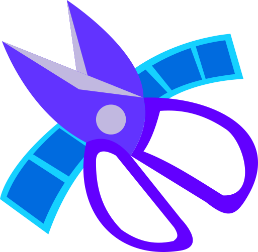

<html>
    
    <body>
        

            

                <h1>Clipit</h1>
                <h3>Create a list with clipped moments of your favorite videos</h3>
                </img>
            

        

    </body>
</html>

## What does it do?

- This extension was created to help fan-made content creators, like podcast clipping channels and youtube stream viewers.
- By clickig `Ctrl+.`, you create a new clip, with the name of the video, the start time and end time of the clip.
- You can later download the list to help you remember where you should cut the video. The list is available in JSON and plain text formats.
- You can also adjust the clip length by clicking in the browser icon and changing the amount of seconds (60 by default).

## How to use
- Install the exension in your browser throght [Chrome Web Store](https://chrome.google.com/webstore/category/extensions)
- Close and reopen your browser, or refresh your tabs
- Visit some video/stream (on youtube, dailymotion, twitch, etc.)
- Press `Ctrl+.`(Ctrl+dot)
- A badge should appear when in the browser icon.
- When you click the browser icon, you should see the list of clips created
- You may download or copy the clips list

Brief usage video:

<video src="clipit.mp4" width='500px'></video>